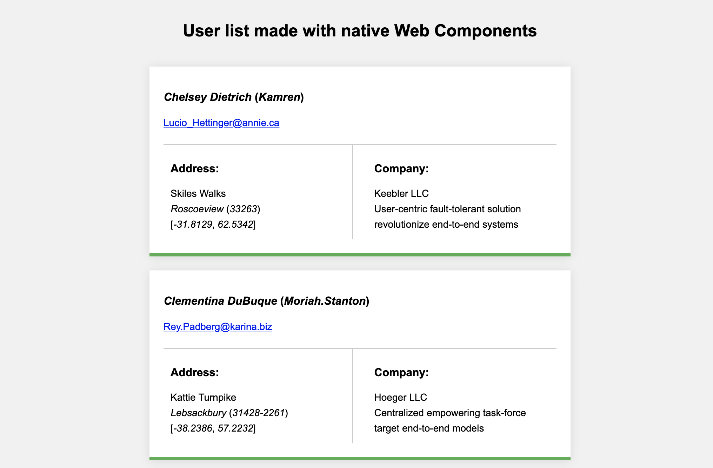

# User List Webcomponent Native

This simple app shows a list of users and for this it is based on the native specification of Web Components of the browser.



## Getting started

* Install `node.js`
* Install npm package globally:
```javascript
npm -g install static-server
````
* Go to the project folder:
```javascript
`$/user-list-webcomponent-native`
````

* Run server
```javascript
static-server --port 8080
````

## Start app

Now, you just have to navigate to `http://localhost:8080/` to see the application working.
